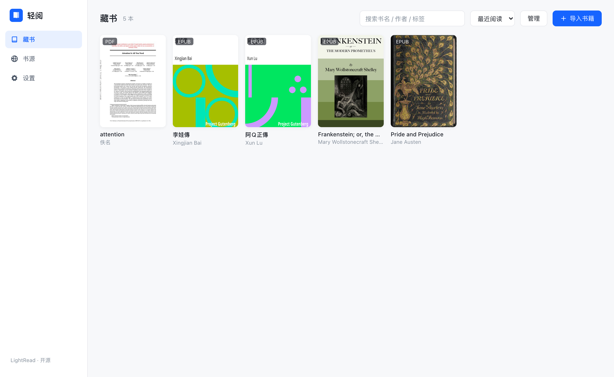
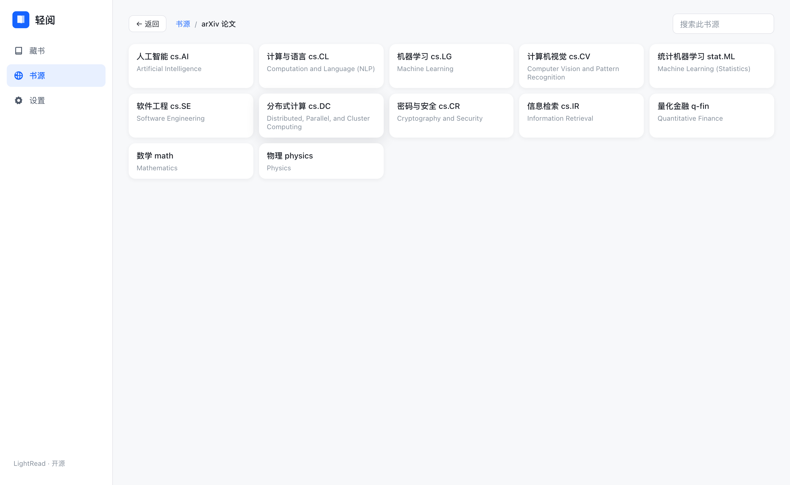
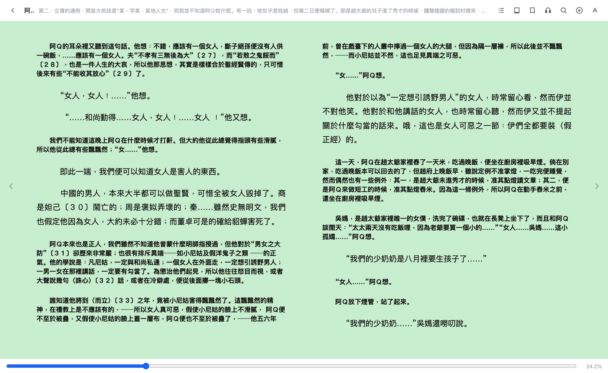
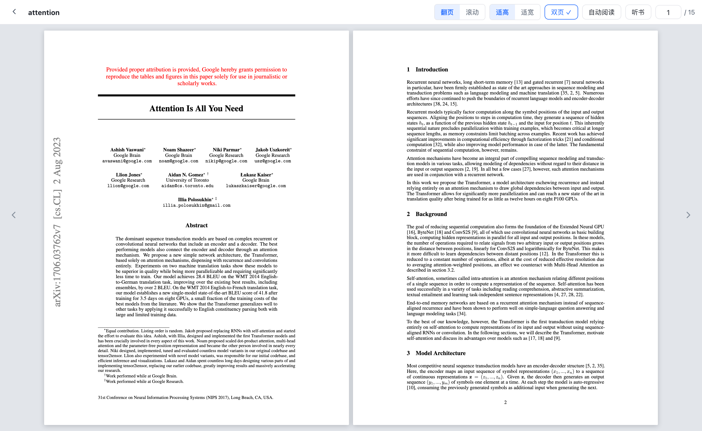
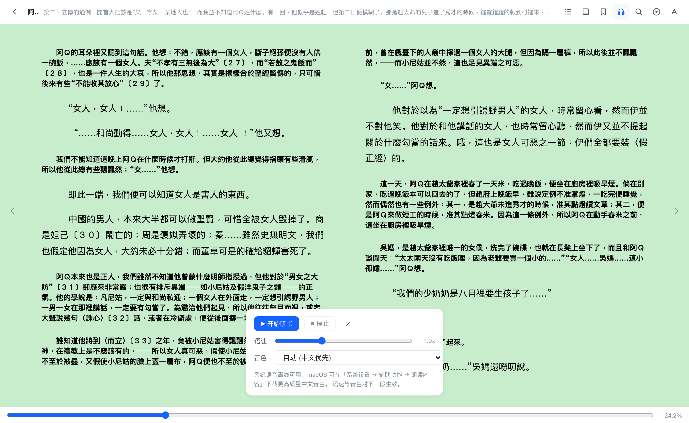

<div align="center">


# LightRead 轻阅

**开源、本地优先的电子书与论文阅读器。**

藏书、论文、阅读进度和批注默认保存在自己的设备上；无需注册账号，本地阅读无需联网。

[](LICENSE)


### [⬇️ 新手点这里下载最新版](https://github.com/yzfly/LightRead/releases/latest)

[安装教程](#下载与安装) · [第一次使用](#第一次使用) · [论文阅读](#论文阅读与-ai-精读) · [如何更新](#如何更新) · [问题反馈](https://github.com/yzfly/LightRead/issues)

**如果 LightRead 对你有帮助，欢迎在 [GitHub](https://github.com/yzfly/LightRead) 点个 ⭐ Star，你的支持是项目持续更新的动力。**



</div>

---

## LightRead 能做什么

- **阅读常见电子书**：EPUB、MOBI、AZW / AZW3、FB2 / FB2.zip、CBZ / CBR、DjVu、PDF、TXT、HTML、Markdown。
- **管理藏书与论文**：本地导入、拖拽导入、分类标签、置顶、批量管理、阅读进度、书签与批注。
- **专业 PDF 阅读**：MuPDF / PDFium 渲染可选（默认 MuPDF），支持原版/流式重排、翻页、连续滚动、双页、自动阅读和听书。
- **论文精读**：独立论文库、划词翻译、版式对照翻译、论文总结、论文十问、全文问答和 BabelDOC 整本翻译。
- **找书和找论文**：OPDS、Calibre、GitHub 社区书源、古登堡计划和 arXiv。
- **听书**：在线神经音色、本地离线模型和系统语音三种方式。
- **备份与迁移**：导出 / 恢复 zip 备份，可选 WebDAV 云备份和自定义书库存储位置。

> 本地阅读不需要账号或网络。书源下载、在线听书、AI、版本检查和 WebDAV 是可选联网功能；使用哪个服务由你自己决定。

## 下载与安装

只从本项目的 [GitHub Releases](https://github.com/yzfly/LightRead/releases/latest) 下载。页面打开后，找到 **Assets**，按照自己的系统选择文件。

文件名中的 `x.y.z` 是版本号，例如 `1.1.0`。

| 你的设备 | 应下载的文件 | 说明 |
|---|---|---|
| Mac，Apple M 系列芯片 | `LightRead_x.y.z_aarch64.dmg` | Apple Silicon 版 |
| Mac，Intel 处理器 | `LightRead_x.y.z_x64.dmg` | Intel 版 |
| Windows 10 / 11，64 位 | `LightRead_x.y.z_x64-setup.exe` | 推荐的 Windows 安装程序 |
| Ubuntu / Debian，64 位 | `LightRead_x.y.z_amd64.deb` | Debian 系安装包 |
| Fedora / RHEL，64 位 | `LightRead-x.y.z-1.x86_64.rpm` | RPM 安装包 |
| 其他 64 位 Linux | `LightRead_x.y.z_amd64.AppImage` | 免安装便携版 |
| Android，arm64 | `LightRead_vx.y.z_android_arm64.apk` | 实验版本 |

不知道 Mac 是哪种处理器？点击左上角苹果菜单 → **关于本机**：显示“芯片 Apple M…”就下载 `aarch64.dmg`，显示“处理器 Intel”就下载 `x64.dmg`。

### macOS

1. 下载对应的 `.dmg` 文件并双击打开。
2. 把 **LightRead** 拖到 **Applications / 应用程序** 文件夹。
3. 到“应用程序”中打开 LightRead。
4. 如果 macOS 提示无法验证开发者，先确认文件来自本仓库，然后右键 LightRead → **打开**；仍被阻止时，进入“系统设置 → 隐私与安全性”，点击 **仍要打开**。

升级时再次打开新版 DMG，把 LightRead 拖进“应用程序”并选择替换即可，不需要先卸载旧版。

### Windows

1. 下载 `LightRead_x.y.z_x64-setup.exe`。
2. 双击安装程序，按提示完成安装。
3. 如果 SmartScreen 出现提示，先确认发布者文件来自本仓库，再点击“更多信息 → 仍要运行”。
4. 从开始菜单打开 LightRead。

升级时直接运行新版安装程序覆盖安装，藏书和设置不会因为覆盖安装而删除。

### Linux

Ubuntu / Debian 用户可以双击 `.deb` 安装，也可以在下载目录运行：

```bash
sudo apt install ./LightRead_x.y.z_amd64.deb
```

Fedora / RHEL 用户：

```bash
sudo dnf install ./LightRead-x.y.z-1.x86_64.rpm
```

使用 AppImage 时，先赋予执行权限再运行：

```bash
chmod +x LightRead_x.y.z_amd64.AppImage
./LightRead_x.y.z_amd64.AppImage
```

请把命令里的 `x.y.z` 换成实际下载的版本号，也可以直接输入文件名前几个字母后按 `Tab` 自动补全。

### Android（实验性）

1. 下载 `android_arm64.apk`，在系统设置中允许浏览器或文件管理器“安装未知应用”。
2. 打开 APK 完成安装。目前仅提供 arm64 架构，界面和交互仍在持续适配。
3. 如果升级时提示签名不一致，请先在 LightRead 的“设置 → 数据”中导出备份，再卸载旧 APK、安装新版并恢复备份。

## 第一次使用

1. **导入书籍**：进入左侧“藏书”，点击“导入书籍”，或者把文件直接拖进窗口。支持一次选择多个文件。
2. **导入论文**：进入左侧“论文”，点击“导入论文”；也可以在“书源 → arXiv”下载后直接阅读。
3. **开始阅读**：点击书籍或论文封面。阅读页顶部可以切换翻页 / 滚动、适高 / 适宽、双页、自动阅读和听书。
4. **分类整理**：在藏书或论文页点击“管理”，可批量设置标签、移动、置顶或删除。
5. **设置存储与备份**：进入“设置 → 数据”，可以更改书库位置、导出 zip 备份，或配置 WebDAV。

桌面版安装后，还可以在系统文件管理器中右键 PDF、EPUB、MOBI、AZW、FB2、CBZ / CBR、DjVu、TXT、HTML、Markdown 等文件，选择 **打开方式 → LightRead**。如果希望以后都用 LightRead 打开，请勾选“始终使用”或在系统中设为默认应用。

导入的文件、封面、进度和批注默认进入 LightRead 的本地数据目录。需要自己管理文件位置时，可在“设置 → 数据 → 存储位置”选择一个专用文件夹。

## 论文阅读与 AI 精读

“论文”是独立于普通藏书的工作区。把 PDF 导入“论文”后，会启用完整的论文精读功能；普通藏书中的 PDF 默认保持简洁阅读界面，也可以在管理模式中移入论文库。

<div align="center"></div>

- **连续阅读与清晰渲染**：论文默认连续滚动，可切换为类 EPUB 的单栏流式正文；原版页面由可选的 MuPDF 或 PDFium 按设备像素比绘制（默认 MuPDF），PDFium 提供文字选择、链接、目录、批注和文本分析。
- **划词工具**：选择文字后可高亮、写想法、复制或 AI 翻译；标注可以集中查看并跳回原文。
- **引文与目录跳转**：点击页内链接或目录后，可以一键回到刚才的阅读位置。
- **AI 中文翻译**：右侧支持“版式对照”和“段落列表”；滚动到哪一页就按需翻译哪一页，翻译结果会缓存。
- **AI 辅读**：生成论文总结，按“论文十问”框架逐项粗读，或在独立问答页基于论文全文提问。
- **整本重排版翻译**：桌面端可选安装 BabelDOC，生成保持图表、公式和原版布局的中文版 / 双语版 PDF，并自动导入论文库。该功能需要额外安装约 700 MB 的模型和工具。
- **arXiv**：在“书源”里按分类浏览或搜索 arXiv，下载后直接进入本地阅读流程。

AI 功能不会在打开论文时自动消耗模型用量，只有点击翻译、总结或提问后才会请求模型。进入“设置 → AI 助手”可以选择内置限速试用通道，也可以配置硅基流动、智谱、千问、Kimi、豆包、本地 Ollama 或任意 OpenAI 兼容接口。

> 扫描版或纯图片 PDF 如果没有文本层，将无法进行文字选择、听书和 AI 文本分析；普通页面阅读不受影响。

## 电子书与 PDF 阅读

<div align="center"></div>

- 翻页 / 滚动双模式，宽屏双栏，触屏点击和滑动翻页。
- 白色、米黄、护眼绿、夜间四种主题；可调字号、行距、页边距和字体，并支持导入自定义字体。
- 全书检索支持多关键词、正则表达式、区分大小写和全词匹配。
- 四色划线、写想法、书签、目录定位和阅读时长统计。
- 普通阅读页也支持 AI 问答和划词解读，AI 服务为可选配置。

<div align="center"></div>

- PDF 默认适高整页，可切换适宽、连续滚动和双页并列。
- 自动阅读会根据当前模式连续滚动或自动翻页，控制条可自动收起。
- PDF 页面可在设置中选择 MuPDF 或 PDFium 渲染，默认使用与 SumatraPDF 同源的 MuPDF；阅读页可在原版与单栏流式正文之间切换，文字选择、目录、链接和标注由 PDFium 提供。
- 桌面系统注册文件关联，可通过“打开方式”直接打开 PDF 和其他支持格式。

## 听书

<div align="center"></div>

- 在线神经音色：微软 Edge 大声朗读音色，需要联网，不可用时自动回退。
- 本地离线模型：桌面版可下载约 310 MB 的 sherpa-onnx + Kokoro 语音包，提供 103 个中英音色。
- 系统语音：无需额外下载，音色数量和质量由操作系统决定。
- EPUB 会跟随朗读位置；带文本层的 PDF 支持逐页朗读和自动翻页；语速可调。

## 藏书、书源与备份

- 拖拽批量导入、本地文件导入、网页直链导入，自动读取标题、作者和封面。
- 统一搜索古登堡计划、GitHub 社区书源和 arXiv；支持 OPDS 以及带账号验证的 calibre-web。
- 桌面版可以直接连接本机 Calibre 书库文件夹，读取书目、作者和封面。
- 支持 HTTP / HTTPS / SOCKS4 / SOCKS5 网络代理。
- zip 备份包含藏书、论文、进度、标注和书源，可跨设备恢复。
- 可选 WebDAV 备份，支持坚果云、Nextcloud、Alist 等服务；已有数据会增量合并。

GitHub 社区书源清单保存在 [booksources.json](booksources.json)。欢迎提交 PR 推荐合法、可直接下载书籍文件的公开仓库；不收录纯链接聚合、侵权内容或网盘跳转。

## 如何更新

推荐使用应用内更新检查：

1. 打开 LightRead，进入左下角 **设置**。
2. 在 **关于** 区域点击 **检查更新**。
3. 发现新版后，点击适合当前系统的下载按钮。桌面版会下载到系统“下载”文件夹并尝试打开安装包。
4. macOS 将新版拖入“应用程序”并覆盖；Windows 运行新版安装程序；Linux 安装新版包或替换 AppImage。

也可以随时访问 [GitHub 最新版本](https://github.com/yzfly/LightRead/releases/latest) 手动下载。

桌面端覆盖安装不会删除藏书、论文、进度和设置。重要资料仍建议在更新前进入“设置 → 数据 → 导出备份”保存一份 zip。不要为了升级而手动删除 LightRead 的应用数据目录。

## 常见问题

### 下载后打不开怎么办？

先确认文件来自 `github.com/yzfly/LightRead`。macOS 请按上面的“右键打开 / 隐私与安全性”步骤操作；Windows 可在 SmartScreen 中查看“更多信息”；Linux AppImage 需要先添加执行权限。

### 为什么 AI、翻译或书源无法使用？

这些功能需要网络。可以先到“设置 → AI 助手”测试模型连接，到“设置 → 网络”测试代理；本地阅读、书架、进度和批注不受影响。

### 为什么扫描版 PDF 不能划词或听书？

扫描版通常只有图片，没有可选择的文字层。LightRead 可以正常显示页面，但文字相关功能需要 PDF 自带文本层；目前不内置 OCR。

### 支持 Kindle KFX 或带 DRM 的书吗？

不支持 KFX 和 DRM 加密文件。请先使用合法方式在 Calibre 等工具中转换为 EPUB、AZW3 或其他受支持格式。

## 从源码运行

需要 Node.js、Rust 工具链以及对应平台的 Tauri 2 构建依赖：

```bash
git clone https://github.com/yzfly/LightRead.git
cd LightRead
npm install
npm run tauri dev
```

构建前端或桌面安装包：

```bash
npm run build
npm run tauri build
```

核心结构：Vue 3 + TypeScript 负责界面，foliate-js 负责电子书，MuPDF / PDFium 负责可选的 PDF 页面渲染，PDFium 同时负责 PDF 交互和文本几何，Tauri 2 / Rust 提供桌面文件系统、SQLite、网络和本地能力。网页版可以通过 `npm run build` 生成，但桌面版拥有完整的文件关联、Calibre、本地离线语音和无跨域网络能力。

## 反馈、联系与参与

- 功能建议和问题反馈：[GitHub Issues](https://github.com/yzfly/LightRead/issues)
- 作者：**江树 / 云中江树**
- 微信：**1796060717**（添加时请备注 `LightRead`）
- 微信公众号：**云中江树**

欢迎提交 Issue、Pull Request 或新的合法书源。如果这个项目对你有帮助，也欢迎给仓库点一个 [⭐ Star](https://github.com/yzfly/LightRead)。

## 开源协议

[GNU Affero General Public License v3.0 or later](LICENSE)

LightRead 使用 AGPL 授权的 MuPDF，因此项目整体以 AGPL-3.0-or-later 发布。分发修改版或通过网络向用户提供修改版服务时，须依照协议提供对应源代码。

致谢：[foliate-js](https://github.com/johnfactotum/foliate-js) (MIT) · [MuPDF](https://mupdf.com/) (AGPL-3.0-or-later) · [PDFium](https://pdfium.googlesource.com/pdfium/) (BSD-3-Clause) · [BabelDOC](https://github.com/funstory-ai/BabelDOC) · 截图书籍来自 [古登堡计划](https://www.gutenberg.org/)
