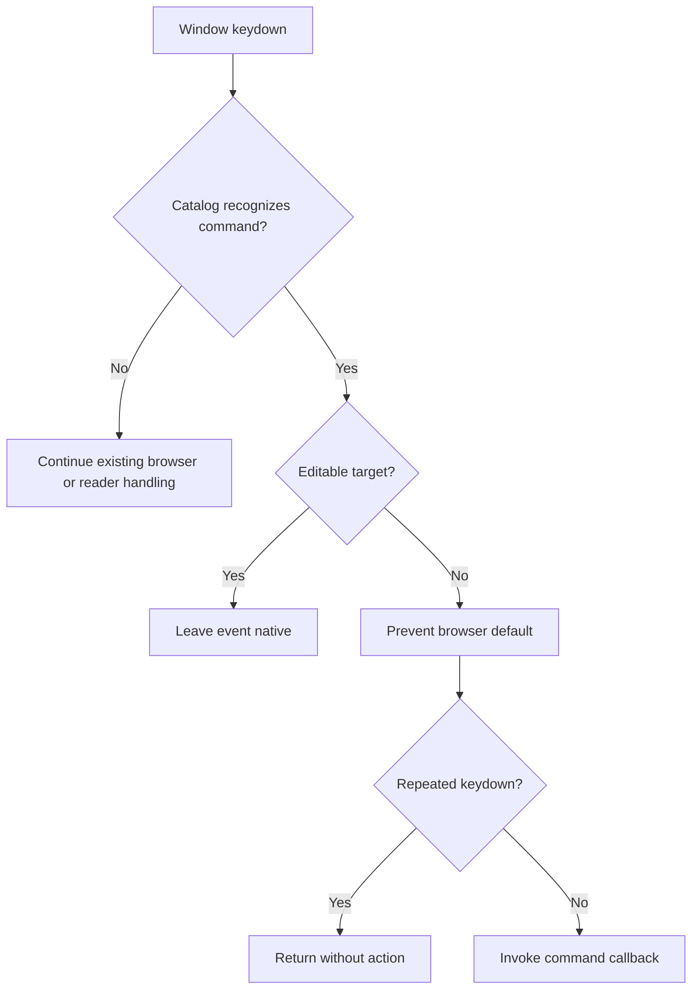
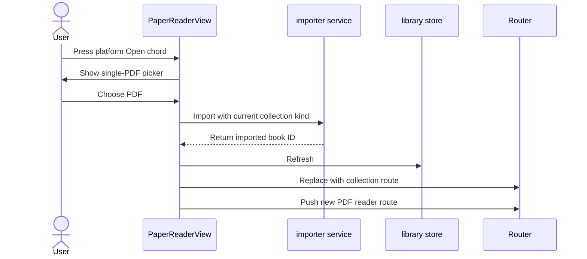

# PDF Reader Shortcut Completion - Plan

## Goal Capsule

- **Objective:** Complete the first-phase PDF reader shortcut experience with standard Save and Open commands, native editable-control behavior, repeat-safe execution, and a help panel that matches runtime capability.
- **Authority:** The confirmed Product Contract and its session-settled decisions override implementation convenience.
- **Execution profile:** Standard frontend change across keyboard dispatch, PDF import/navigation, help UI, localization, and focused tests.
- **Stop conditions:** Stop if Open cannot preserve the current collection kind, if changing the reader route cannot force a clean remount, or if a shortcut must override an OS/browser-owned chord outside the confirmed scope.
- **Tail ownership:** Finish with focused shortcut tests, PDF reader browser coverage, the existing paper-context regression suite, and a production build.

---

## Product Contract

### Summary

Complete PDF reader shortcuts without widening to other reader types. Add standard Save and Open commands, preserve native editing behavior, suppress repeated work, and make the shortcut guide the accurate inventory of supported PDF commands.

### Problem Frame

The PDF reader already has many keyboard commands, but the implementation and help panel have drifted. Several primary-modifier branches run before editable-target protection, only Copy suppresses held-key repeats, and several live commands are missing from the guide. Standard Save and Open aliases are also absent.

### Requirements

**System shortcut behavior**

- R1. The PDF reader supports `Cmd+S` on macOS and `Ctrl+S` on Windows/Linux as aliases for the existing save-a-copy flow.
- R2. The PDF reader keeps `Cmd/Ctrl+Shift+S` as a documented compatibility shortcut for the same save-a-copy flow; neither command overwrites the imported source in place.
- R3. The PDF reader supports `Cmd+O` on macOS and `Ctrl+O` on Windows/Linux to choose one local PDF, import it into the current collection kind, and open the imported document.
- R4. App-owned primary shortcuts use the platform's primary modifier only, reject mixed `Ctrl+Meta` and `Alt` variants, and do not claim browser/OS-owned commands outside this plan.

**Input safety and execution**

- R5. Inputs, textareas, selects, notes, contenteditable elements, and textbox-role elements retain native system shortcut behavior.
- R6. Unrelated keydown events do not query PDF text, browser selection text, or editable-target DOM ancestry.
- R7. A held app-owned shortcut prevents its browser default when applicable but starts its action only on the initial keydown.
- R8. Canceling Open or Save is a no-op, and an import/save failure leaves the current document usable while reporting the existing localized error pattern.

**Help and capability parity**

- R9. The shortcut guide lists every PDF reader command recognized by the runtime shortcut catalog, including existing search, navigation, history, view, presentation, and panel commands.
- R10. The guide hides commands that are unavailable in the current collection or layout, and it shows the reflow-specific zoom reset instead of original-layout-only zoom modes.
- R11. The expanded guide remains usable in a viewport shorter than its complete command list.

### Key Decisions

- KD1. **PDF-only first phase.** (session-settled: user-directed — chosen over immediate PDF/EPUB/MOBI/DjVu parity: the user selected a bounded PDF rollout before cross-reader unification.) Governs R1-R11.
- KD2. **Editable controls keep native shortcuts.** (session-settled: user-approved — chosen over global reader interception: the user confirmed that inputs, notes, and editable areas must preserve system behavior.) Governs R5.
- KD3. **Keyboard work stays lazy and repeat-safe.** (session-settled: user-approved — chosen over eager DOM/PDF probing and repeat-triggered actions: the user confirmed both hot-path and held-key constraints.) Governs R6-R7.
- KD4. **Help reflects complete runtime support.** (session-settled: user-approved — chosen over documenting only newly added shortcuts: the user confirmed that the help panel must show all supported operations.) Governs R9-R11.

### Key Flows

- F1. Save a PDF copy
  - **Trigger:** The user presses the platform Save chord outside an editable control.
  - **Steps:** The reader recognizes the chord, suppresses repeats, and invokes the existing save-a-copy action.
  - **Outcome:** The web build downloads the PDF or the desktop build opens the system Save dialog.
  - **Covered by:** R1, R2, R4-R8.
- F2. Open a local PDF
  - **Trigger:** The user presses the platform Open chord outside an editable control.
  - **Steps:** The reader opens a single-PDF picker, validates and imports the chosen file, refreshes the library, leaves the current reader route, and opens the new PDF route.
  - **Outcome:** The imported PDF opens in a fresh `PaperReaderView` instance and belongs to the same Books or Papers collection as the source document.
  - **Covered by:** R3-R8.
- F3. Consult shortcut help
  - **Trigger:** The user opens the shortcut guide.
  - **Steps:** The reader filters the shared catalog against the current PDF state and renders the supported commands in a scrollable panel.
  - **Outcome:** Every displayed command works in the current state, and unavailable commands are absent.
  - **Covered by:** R9-R11.

### Acceptance Examples

- AE1. **Native note editing**
  - **Covers:** R5-R6.
  - **Given:** Focus is inside a note or textbox-role element.
  - **When:** The user presses `Cmd/Ctrl+S`, `Cmd/Ctrl+O`, `Cmd/Ctrl+F`, or `Cmd/Ctrl+P`.
  - **Then:** The reader does not prevent the event or invoke a reader action.
- AE2. **Lazy unrelated keydown**
  - **Covers:** R6.
  - **Given:** The PDF reader is active.
  - **When:** The user presses an unrelated key.
  - **Then:** The reader performs no editable-target, browser-selection, or PDF-text probe.
- AE3. **Held Open shortcut**
  - **Covers:** R7.
  - **Given:** Focus is outside editable controls.
  - **When:** The user holds the platform Open chord and repeat keydowns arrive.
  - **Then:** The browser default stays suppressed and only one picker opens.
- AE4. **Import and remount**
  - **Covers:** R3, R8.
  - **Given:** A PDF is open from the Papers collection.
  - **When:** The user chooses another valid PDF with the Open shortcut.
  - **Then:** The new file imports as a Paper, the library refreshes, the reader route remounts, and the new PDF opens.
- AE5. **Capability-aware help**
  - **Covers:** R9-R11.
  - **Given:** A Paper is open in reflow layout.
  - **When:** The shortcut guide opens.
  - **Then:** It shows the reflow reset command, omits original-layout zoom modes and non-Paper page-layout commands, and remains vertically scrollable.

### Scope Boundaries

#### Deferred to Follow-Up Work

- Cross-reader shortcut parity for EPUB, MOBI, FB2, TXT, and DjVu.
- Multi-page `Cmd/Ctrl+A` PDF text selection.
- Annotation undo/redo and keyboard deletion.

#### Outside This Plan

- Intercepting `Cmd/Ctrl+W`, `Q`, `R`, `T`, or `L` from the browser or operating system.
- Changing PDF save semantics to overwrite the imported source or embed application annotations.
- Adding PDF rotation or other new reader capabilities unrelated to the confirmed shortcut set.

---

## Planning Contract

### Key Technical Decisions

- KTD1. **Use one PDF shortcut catalog.** Define command identifiers, platform chords, repeat policy, help metadata, and state applicability in `src/services/keyboardShortcuts.ts`. Runtime recognition and help rendering consume the same catalog so a supported command cannot silently disappear from documentation.
- KTD2. **Separate recognition from lazy environment probes.** Resolve candidate commands from event and reader state first. Only a recognized candidate may evaluate editable targets or browser/PDF selection state. Action callbacks remain in `PaperReaderView` so the service stays pure and directly testable.
- KTD3. **Apply one repeat gate to app-owned commands.** A recognized non-editable command prevents its browser default on every matching keydown, but the dispatcher invokes its callback only when `event.repeat` is false. This covers existing async Save, Print, layout, and search actions as well as Open.
- KTD4. **Reuse import and route-remount patterns.** Open uses `importFile` from `src/services/importer.ts`, refreshes `useLibrary()`, preserves `paper` versus `book`, leaves the current reader through `backTarget`, and then pushes `/read-paper/:id`. This follows `src/services/externalOpen.ts` because replacing only the route ID does not rebuild reader setup.
- KTD5. **Use a reader-local single-PDF picker.** Add a hidden input without `multiple`, accept only PDF MIME/extensions, reset the input after handling, and validate the chosen format before import. Cancel and invalid-file paths do not navigate away.
- KTD6. **Make complete help scrollable and conditional.** Render catalog groups for document, search, view, navigation, and panels. Filter original-layout and non-Paper commands from reader state, and cap panel height with vertical scrolling.

### High-Level Technical Design

The dispatcher owns recognition and safety gates. The view owns reader state and side effects.

Open PDF follows the established import and remount sequence.

### Sequencing

1. Stabilize the shared catalog and dispatcher before moving existing commands.
2. Add Save/Open callbacks and the import/remount flow after dispatch behavior is testable.
3. Move help rendering onto the catalog after the catalog covers every live command.
4. Finish with browser-level checks for picker, download, editable pass-through, and conditional help.

### Research Anchors

- `src/services/keyboardShortcuts.ts` contains the current lazy Copy dispatcher and focused test seam.
- `src/views/PaperReaderView.vue` owns PDF command callbacks, reader-state predicates, and the shortcut guide.
- `src/views/LibraryView.vue` demonstrates the resettable hidden file input and import progress/error pattern.
- `src/services/externalOpen.ts` demonstrates import, library refresh, route exit, and reader remount.
- `src/services/pdfFileActions.ts` contains cross-platform save-a-copy behavior.
- No `docs/solutions/` learning corpus exists for this feature.

---

## Implementation Units

### U1. Unify PDF shortcut recognition and safety gates

- **Goal:** Make platform matching, editable pass-through, lazy probes, repeat suppression, and help metadata consistent for every PDF reader command.
- **Requirements:** R4-R7, R9; KD2-KD4.
- **Dependencies:** None.
- **Files:**
  - Modify `src/services/keyboardShortcuts.ts`.
  - Modify `src/views/PaperReaderView.vue`.
  - Modify `scripts/test-keyboard-shortcuts.mjs`.
- **Approach:**
  1. Generalize strict macOS versus non-Mac primary-modifier matching from the existing Copy behavior.
  2. Represent all current PDF commands in a catalog with command ID, display chord, applicability, and repeat behavior.
  3. Resolve commands from event/state before calling injected editable or selection probes.
  4. Route existing primary-modifier commands through the shared repeat-safe boundary while keeping bare-key behavior behind the editable guard.
- **Patterns to follow:** `handleReaderCopyShortcut` and its callback-spy tests in `scripts/test-keyboard-shortcuts.mjs`.
- **Test scenarios:**
  1. macOS accepts only Command for app-owned primary commands; Windows/Linux accepts only Ctrl.
  2. Mixed Ctrl+Meta, Alt-modified, shifted-when-not-declared, and unrelated chords do not resolve.
  3. Covers AE1. Editable targets receive native Save, Open, Search, Print, and Copy behavior.
  4. Covers AE2. Unrecognized keys invoke no editable, browser-selection, or PDF-selection callback.
  5. Covers AE3. Repeat events prevent the default for recognized app commands but invoke no action callback.
  6. Every runtime catalog entry is either help-visible with a label or explicitly marked internal with a documented reason.
- **Verification:** Focused tests prove command resolution, callback counts, lazy probes, and repeat handling without mounting Vue.

### U2. Add standard Save and Open PDF commands

- **Goal:** Add standard Save/Open behavior while preserving the existing save semantics and import/navigation lifecycle.
- **Requirements:** R1-R4, R7-R8; F1-F2; KTD1, KTD3-KTD5.
- **Dependencies:** U1.
- **Files:**
  - Modify `src/views/PaperReaderView.vue`.
  - Modify `src/services/keyboardShortcuts.ts`.
  - Modify `scripts/test-keyboard-shortcuts.mjs`.
  - Modify `scripts/e2e-smoke.mjs`.
- **Approach:**
  1. Map the standard Save chord and the existing shifted Save chord to `saveDocumentAs()`.
  2. Add a resettable single-PDF picker and reject non-PDF selections before import.
  3. Import with the current collection kind, refresh the library, leave through `backTarget`, and push the imported PDF route.
  4. Preserve the current document on picker cancel, invalid file, import failure, or save failure.
- **Patterns to follow:** `savePdfAs` in `src/services/pdfFileActions.ts`, the picker flow in `src/views/LibraryView.vue`, and remount navigation in `src/services/externalOpen.ts`.
- **Test scenarios:**
  1. `Cmd/Ctrl+S` and `Cmd/Ctrl+Shift+S` each start one save-a-copy operation on initial keydown.
  2. Holding either Save chord starts no second operation.
  3. `Cmd/Ctrl+O` opens one PDF picker and a repeated event opens no additional picker.
  4. Picker cancel and non-PDF selection leave the current reader route unchanged.
  5. Covers AE4. A valid PDF imports with the current collection kind, refreshes the library, remounts the route, and opens the new ID.
  6. Import failure shows an error and leaves the current PDF usable.
  7. Browser smoke coverage observes the Save download and opens a generated PDF through the shortcut picker.
- **Verification:** Focused tests prove dispatch cardinality; browser smoke coverage proves the real picker/import/remount and download handoffs.

### U3. Make shortcut help complete and capability-aware

- **Goal:** Render every supported PDF command from the catalog without advertising unavailable operations.
- **Requirements:** R9-R11; F3; KTD1, KTD6.
- **Dependencies:** U1, U2.
- **Files:**
  - Modify `src/views/PaperReaderView.vue`.
  - Modify `src/services/keyboardShortcuts.ts`.
  - Modify `src/i18n/en.ts`.
  - Modify `src/i18n/zh.ts`.
  - Modify `scripts/test-keyboard-shortcuts.mjs`.
  - Modify `scripts/e2e-smoke.mjs`.
- **Approach:**
  1. Build grouped help rows from the same catalog used for recognition.
  2. Add matching English and Chinese labels for Open and every previously undocumented command.
  3. Filter layout-specific commands from current `isPaper` and `pdfLayout` state.
  4. Constrain panel height and add vertical scrolling without changing the existing dialog and backdrop behavior.
- **Patterns to follow:** Existing `shortcutRows`, locale key pairing, and `.shortcut-menu` responsive styles in `PaperReaderView.vue`.
- **Test scenarios:**
  1. The catalog-to-help projection includes Save, Open, Copy, Search, Print, history, navigation, view, presentation, TOC, help, and close commands.
  2. Covers AE5. Reflow shows only its reset command; original layout shows applicable zoom modes; Papers hide non-Paper page-layout commands.
  3. English and Chinese locale maps contain every catalog label key.
  4. The full desktop list and one-column mobile list remain scrollable and closable.
  5. Clicking or pressing Escape closes the guide without triggering another reader action.
- **Verification:** Pure tests prove catalog/help parity and applicability; browser smoke coverage proves rendering, scrolling, and close behavior.

---

## Verification Contract

| Gate | Applies to | Done signal |
|---|---|---|
| `npm run test:keyboard-shortcuts` | U1-U3 | Platform, editable, lazy-probe, repeat, catalog, and capability scenarios pass. |
| `npm run test:paper-context` | Global regression | Existing paper translation-context behavior remains green. |
| `npm run build` | U1-U3 | Vue TypeScript checking and the production Vite build pass. |
| `npm run e2e` with the local preview server on port 4173 | U2-U3 | Generated-PDF Open/Save and shortcut-guide browser flows pass without page errors. |
| `git diff --check` | Global quality | The implementation diff has no whitespace errors. |

---

## Definition of Done

- R1-R11 and AE1-AE5 are satisfied with no launch-blocking question.
- `Cmd/Ctrl+S` and `Cmd/Ctrl+O` work in the PDF reader and never override editable controls.
- Every app-owned PDF shortcut is strict-platform, lazy-probed, and repeat-safe.
- Open preserves Books versus Papers kind and remounts the reader before showing the new PDF.
- The help guide is generated from the runtime catalog, is capability-aware, localized in English and Chinese, and scrolls on constrained viewports.
- Focused tests, paper-context regression tests, the production build, applicable browser smoke coverage, and diff checks pass.
- No EPUB/MOBI/DjVu shortcut changes, multi-page selection, undo stack, annotation deletion, source overwrite, or abandoned experimental code remains in the implementation diff.
