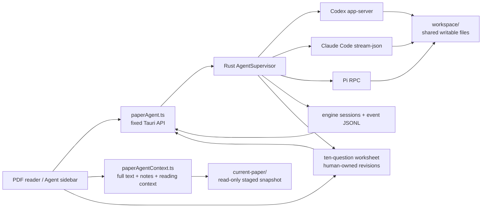
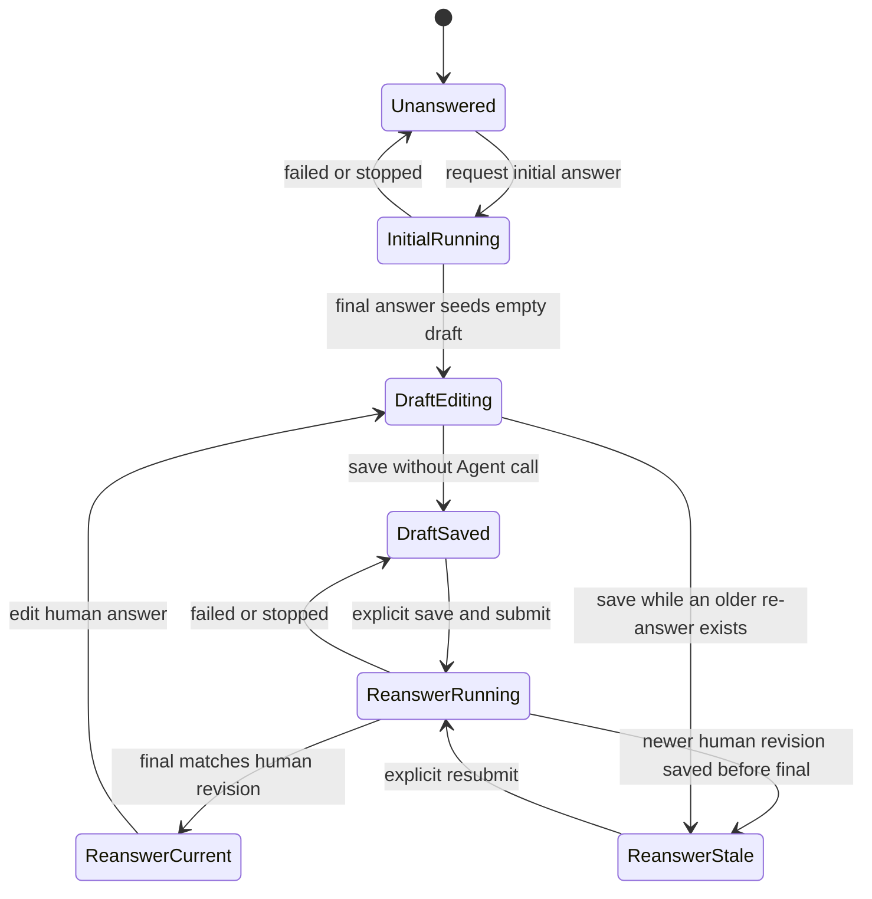

# Paper Agent Conversation Sidebar - Plan

## Goal Capsule

Replace the PDF reader's current summary, paper-ten-question generator, and stateless chat surfaces with one desktop Agent conversation sidebar. The sidebar lets the reader choose Codex, Claude Code, or Pi Agent. Each engine receives a complete, page-marked PDF text snapshot, the original PDF copy, LightRead notes, and the current reading context. The Agent works in a persistent writable workspace without LightRead disabling its native tools, terminal, network, extensions, or subagents. Inside the same sidebar, rebuild the paper-ten-question experience as a human-in-the-loop worksheet: AI initial answer, human revision, then a separate AI answer based on that revision.

Authority order for implementation is: the user's session-settled product decisions, Product Contract requirements, Key Technical Decisions, then Implementation Units. Product behavior in an R-ID overrides a conflicting implementation detail. A KTD owns the mechanism within those requirements.

This is a Deep, desktop-only implementation plan. Do not implement web, mobile, OCR, cross-engine transcript handoff, or automatic note write-back. Stop implementation if an engine cannot expose the required structured conversation, permission, cancellation, and resume capabilities without bypassing its native safety behavior. The current planning turn ends after the plan is reviewed; implementation starts only after user confirmation.

## Product Contract

### Summary

The PDF reader will have one `Agent` tab beside translation. The Agent tab contains an engine selector, availability state, a normal conversation, a structured paper-ten-question worksheet, native tool and permission events, Stop, and an Open Workspace action. The former summary UI and OpenAI-backed ten-question execution path are removed; the ten fixed questions remain inside the Agent sidebar.

For each question, the selected Agent produces a read-only initial answer. LightRead copies that answer into a separate editable `我的回答` draft without changing the original. After the reader edits the draft and explicitly chooses `保存并让 AI 再答`, LightRead saves the human revision first and starts one new Agent turn. The resulting AI re-answer is displayed separately and never overwrites the human text.

The three engines share one writable workspace per paper, but each keeps an independent conversation and native session. One paper permits only one active turn at a time. Hiding the sidebar or leaving the paper page does not cancel that turn; explicit Stop or application exit does.

### Problem Frame

The current paper AI path is not a document-reading Agent. `src/views/PaperReaderView.vue` builds a document string until `DOC_CHAR_BUDGET` is reached, and `src/services/paperAI.ts` sends independent OpenAI-compatible requests for summaries, ten questions, and chat. The current 24,000-character ceiling can omit most of a long paper. The split UI also prevents a real engine from using its tools, inspecting the PDF, retaining a native session, or writing durable results.

### Actors

- A1. Reader — reads a PDF, maintains highlights and notes, asks questions, edits and submits paper-ten-question answers, reviews tool activity, answers native permission or input requests, and opens Agent-created files.
- A2. LightRead — owns source PDF and annotation data, creates context snapshots, supervises native processes, and projects engine events into the UI.
- A3. Native engine — Codex, Claude Code, or Pi Agent running with its installed configuration and authentication.

### Key Flows

- F1. First question — the reader selects an available engine, sends a message, waits for context preparation, then receives streamed text and tool events.
- F2. Context refresh — after a page, selection, or note change, the next send rebuilds the snapshot and binds the new revision to that turn.
- F3. Native interaction — an engine asks for permission or user input, LightRead renders engine-provided choices, and the answer is routed only to the matching pending request.
- F4. Engine switch — the reader may select another engine at any time and see that engine's independent conversation while all engines continue to share the paper workspace. During an active turn, the selected conversation is read-only, Send stays disabled, and the sidebar keeps the running engine and Stop action visible.
- F5. Stop and resume — Stop interrupts the native turn, terminates its controlled process tree if needed, preserves partial output, and never automatically resends a side-effecting message.
- F6. Background return — the reader hides or leaves the sidebar, returns later, and receives the persisted event projection after the last seen sequence.
- F7. Paper-ten-question revision — the reader requests an AI initial answer for one fixed question, edits a separate human draft, then explicitly submits that saved revision for one AI re-answer grounded in the paper and the exact submitted text.

### Requirements

#### Conversation experience

- R1. Replace the PDF reader's `AI 辅读` and `问答` tabs with one desktop `Agent` tab while preserving translation, selection translation, and BabelDOC behavior.
- R2. The Agent tab must offer Codex, Claude Code, and Pi Agent with independent installed, version-compatible, and authenticated states; one unavailable engine must not block the others.
- R3. Each paper and engine pair must retain independent projected ordinary-chat and worksheet conversations with their native session IDs, while all three engines and both conversation types for that paper share one writable workspace.
- R4. The sidebar must stream assistant text, show compact tool activity, render native permission or input cards, provide Stop, and provide Open Workspace without recreating the dedicated summary workflow.
- R5. A paper may have only one active turn across all engines; while it runs, other engines remain viewable but cannot send another turn.

#### Context and workspace

- R6. Before the first turn, LightRead must create `current-paper/paper.pdf`, `paper.txt`, `notes.md`, and `context.md`; the Agent must start in the sibling writable `workspace/` directory.
- R7. `paper.pdf` must be a copy, never a symbolic link or hard link to the library original; `paper.txt` must cover every PDF page with stable page markers and no character budget.
- R8. `notes.md` must serialize every PDF highlight and note with page, selected text, note text, color, timestamp, and annotation ID; an empty note set must still produce an explicit valid document.
- R9. `context.md` must include paper metadata, page count, current page, current selection or an explicit no-selection value, extraction status, snapshot revision, and file hashes; it must not include screen coordinates or credentials.
- R10. Context preparation must use a staged write and switch only before a turn starts; a running turn stays bound to its recorded revision, and later reader changes are applied only to the next turn.
- R11. The four context files must be marked read-only by the platform and regenerated from LightRead's authoritative PDF and annotation data when their hashes change. This is accidental-write protection, not an operating-system security sandbox.
- R12. LightRead must not add tool allowlists, network restrictions, terminal restrictions, extension disabling, subagent disabling, or automatic permission bypass flags. Each engine's installed configuration remains authoritative.

#### Runtime, permissions, and recovery

- R13. Codex must use app-server stdio, Claude Code must use its version-gated streaming JSON protocol, and Pi must use RPC mode; LightRead must not emulate these engines with a Chat Completions request.
- R14. Engine-originated permission and input requests must preserve engine-specific choices and opaque payloads. Duplicate, late, mismatched, and expired answers must not act on another request.
- R15. Hiding the sidebar or leaving the paper route must not stop an active turn. Explicit Stop and normal application exit must interrupt the native engine, terminate its controlled process tree, and reap the root process.
- R16. Each persisted event must carry paper ID, engine, conversation ID, turn ID, monotonically increasing sequence, context revision, and timestamp so the UI can replay without loss or duplication.
- R17. A crash, malformed protocol frame, or failed native resume must preserve prior text and workspace, mark an unfinished turn interrupted, and require a user action before starting a new native session; LightRead must never automatically replay the last user message.
- R18. Claude Code may run in the published integration only when its authentication status reports an Anthropic API key or supported cloud provider. Personal Claude subscription OAuth must be reported as unsupported for this third-party integration and must not be routed through LightRead.

#### Availability and lifecycle

- R19. Engine discovery must support a saved absolute executable path, the GUI process PATH, a small set of known installation locations, and manual file selection; LightRead must not run a login shell, auto-install a CLI, or perform engine login.
- R20. Agent data must live under LightRead application data, outside the configurable library root and existing OKF backup. Deleting a paper must first stop its active Agent, then delete its context, workspace, worksheet answers, event projection, and native session metadata before deleting the library record.
- R21. The Agent tab is desktop-only. Web and mobile builds must compile without process integration and must retain the existing non-Agent translation features.

#### Paper-ten-question worksheet

- R22. The Agent sidebar must contain a paper-ten-question worksheet using the existing ten localized questions with stable IDs independent of display language or list position. Each question card must show a read-only AI initial answer, an editable human answer, and a separate read-only AI re-answer.
- R23. When the initial answer completes and no human draft exists, LightRead must seed the human draft with a copy while preserving the initial answer unchanged. Draft editing and saving must remain available even while another turn is active. Invoking `保存并让 AI 再答` must first persist the exact current human revision and start the Agent turn only after that save succeeds; typing, autosave, blur, or engine switching must never trigger an Agent turn.
- R24. Each AI initial answer and re-answer must run through the currently selected native engine and the paper-level single-turn supervisor. A re-answer turn must receive the fixed question, immutable initial answer, exact submitted human revision, and current paper context revision. It must record its engine, native session and turn IDs, context revision, and human revision; failure, Stop, replay, or a later human edit must never clear or overwrite human text.

### Acceptance Examples

- AE1. Covers R6–R10 — Given a 500-page text PDF with notes on page 480, when the reader sends the first question, the UI shows preparation progress and the engine can cite page 480 without a 24,000-character truncation.
- AE2. Covers R8–R10 — Given a running Codex turn, when the reader changes page, edits a note, and clears the selection, Codex finishes against its old revision and the next turn receives the new page, edited note, and explicit no-selection value.
- AE3. Covers R5 and R10 — Given Pi is running on a paper, when the reader switches the selector to Claude, the prior conversation may be viewed but Send stays disabled until Pi completes or is stopped.
- AE4. Covers R7 and R11 — Given an Agent changes the read-only snapshot after clearing its file attribute, when the next turn is prepared, LightRead detects the hash mismatch, restores the snapshot from source data, and the library PDF and annotations remain unchanged.
- AE5. Covers R7 and R9 — Given a scanned PDF with no extractable text, when context preparation completes, `paper.txt` states that no text was extracted, `paper.pdf` remains available, and the UI does not promise that every engine can visually read it.
- AE6. Covers R14–R16 — Given a permission card is pending when the sidebar is hidden, when the reader returns, the same request is restored once; a response for an older request ID is rejected.
- AE7. Covers R15–R17 — Given an Agent has already written a workspace file and then crashes, when LightRead reopens, the partial reply and file remain, the turn is marked interrupted, and the last message is not resent.
- AE8. Covers R18 — Given `claude auth status --json` reports a personal subscription login, when the reader selects Claude Code, the sidebar explains the supported API-key or cloud-provider requirement and does not start a model request.
- AE9. Covers R19 — Given Codex is missing but Pi is compatible and authenticated, when the reader opens Agent, Pi remains usable and translation remains unaffected.
- AE10. Covers R20 — Given a paper has an active Agent and workspace files, when deletion is confirmed, LightRead stops and reaps the Agent, removes the full Agent paper directory, then removes the library record; a cleanup failure aborts deletion with a retryable error.
- AE11. Covers F7 and R22–R23 — Given Q3 has no answer, when the reader asks Pi for an initial answer, the answer streams into a read-only region and its completed text seeds `我的回答`; editing the draft changes neither the initial answer nor any Agent transcript event.
- AE12. Covers F7 and R23–R24 — Given the reader has changed and saved the Q3 draft, when `保存并让 AI 再答` is chosen with Codex selected, LightRead persists the human revision before starting Codex and the re-answer is bound to the exact saved text, even if Pi produced the initial answer.
- AE13. Covers R23–R24 — Given a re-answer is running for human revision 4, when the reader saves revision 5, revision 5 remains authoritative and the eventual revision-4 result is retained but marked stale; it cannot replace the human answer or masquerade as current.
- AE14. Covers R5 and R23–R24 — Given another paper turn is active, when the reader edits and saves a ten-question draft, the save succeeds but AI re-answer remains disabled; after Stop or completion, one explicit submission starts exactly one turn.

### Success Criteria

- All three tested engines complete multi-turn conversations, read content beyond the old budget, reference exported notes, and create a file in the shared workspace.
- A reader can complete all ten worksheet questions through AI initial answer, human revision, and AI re-answer without losing human text across reload, Stop, engine change, or failed resume.
- Context extraction keeps the reader responsive and visibly reports progress for a 500-page fixture.
- Native tool and permission events remain ordered and recoverable after the sidebar unmounts and remounts.
- Stop and application exit remove the supervised root process and its controlled descendants on macOS, Linux, and Windows fixtures.
- Existing translation, BabelDOC, keyboard shortcut, web build, and Android compile paths regress neither behavior nor buildability.

### Scope Boundaries

Now includes the desktop Agent sidebar, three adapters, complete context snapshots, one shared workspace per paper, independent engine sessions, the paper-ten-question human-revision worksheet, structured permissions, persistence, Stop, background continuation, discovery, and cleanup.

Later includes OCR, batch generation of all ten worksheet questions, answer-history browsing, worksheet export, reviewed Agent-to-note import, cross-engine transcript handoff, multiple conversation management, workspace file preview/editing, notifications, Agent data backup/sync, and mobile or remote Agents.

Never in this feature: expose arbitrary shell execution to the WebView, auto-install or log in to an engine, store engine credentials in LightRead, silently auto-approve native permission requests, let Agent output overwrite a human worksheet answer, the source PDF, or the annotation database, or describe same-user read-only attributes as a sandbox.

## Planning Contract

### Key Technical Decisions

- KTD1. Use a Tauri-managed `AgentSupervisor` with fixed engine and conversation commands, not `tauri-plugin-shell` or a frontend-provided executable/argument API. The supervisor owns child processes, protocol framing, request correlation, persistence, and cancellation. This follows the narrow native command pattern already used by `src-tauri/src/babeldoc.rs` while avoiding its untagged global event and immediate-child cancellation limitations. Governs R13–R17 and R19.

- KTD2. Use one shared `workspace/` per paper and separate native session/event state per engine and conversation type. Enforce one active turn per paper in the supervisor. (session-settled: user-approved — chosen over a restricted or per-engine-only workspace: the user wants Agents to retain write capability, and a shared sequential workspace makes their artifacts available after engine switches.) Governs R3, R5, R6, and R12.

- KTD3. Build `current-paper/` as a LightRead-owned committed snapshot. Regenerate `paper.pdf` and `paper.txt` only when the source PDF fingerprint, extractor version, or either static-file hash is invalid. Before each turn, regenerate `notes.md` from authoritative annotations when its inputs or hash differ, then write `context.md` last from the current reading state as the revision manifest. A changed dynamic input must not recopy or re-extract the unchanged PDF. Do not refresh while that paper has an active turn. (session-settled: user-directed — chosen over writable context or capability-reducing sandboxing: the four context files are read-only while the Agent keeps its native abilities.) Governs R6–R11.

- KTD4. Normalize only the UI lifecycle and keep the engine payload. The common event set is `session_ready`, `text_delta`, `message_completed`, `tool_started`, `tool_updated`, `tool_completed`, `interaction_requested`, `turn_completed`, `turn_interrupted`, and `error`. Every event also retains its engine kind and opaque payload. This prevents a false universal allow/deny model. Governs R14, R16, and R17.

- KTD5. Use the official native protocols at their stable embedding boundary: Codex app-server JSON-RPC over stdio with no experimental API; Claude Code `-p` bidirectional stream JSON with partial messages and feature-gated control requests; Pi `--mode rpc` with strict LF framing. Do not override model, tools, sandbox, extensions, skills, provider, or permission settings. Codex app-server schema and Claude control frames are version-sensitive, so compatibility is established by executable version plus capability probes and fixture contracts rather than by optimistic parsing. Governs R12–R14 and R19.

- KTD6. Treat Claude Code as a local CLI adapter but enforce Anthropic's third-party authentication rule. The adapter reads `claude auth status --json`, accepts API-key or documented cloud-provider authentication, and rejects personal subscription OAuth before model execution. LightRead never reads or stores the credential. This keeps the selected Claude Code engine without routing a user's subscription on their behalf. Governs R2, R18, and R19.

- KTD7. Persist an append-only normalized JSONL projection plus native session metadata under application data. The native transcript remains the resume source; the LightRead projection exists for deterministic UI recovery and diagnostics. A per-conversation sequence makes replay idempotent. Governs R3 and R16–R17.

- KTD8. Cancel in two stages. Send the protocol-native interrupt first, then after a bounded grace period terminate the supervised process group on Unix or Windows Job Object and reap the root. A same-user Agent can deliberately detach a process, so the product promises cleanup of controlled descendants rather than containment. Governs R15 and R17.

- KTD9. Keep the existing OpenAI-compatible provider settings and generic document helper required by translation. Remove the old summary, stateless chat, localStorage ten-question cache, and OpenAI ten-question execution path, but move the ten stable question definitions into the new Agent worksheet module. `src/services/paperTranslationContextGeneration.ts` must continue to have a working generic `askDoc` dependency. Governs R1, R21, and R22.

- KTD10. Store Agent data under application data rather than the custom library root. Do not include it in library migration or OKF backup in this release. Paper deletion removes it after the existing confirmation text is extended to mention Agent conversations, human worksheet answers, and workspace artifacts. Governs R20.

- KTD11. Store the worksheet as LightRead-owned versioned state under the paper's Agent application-data directory, outside the Agent-writable workspace. Identify questions by stable `q1`–`q10` IDs plus i18n keys, not translated text or array indexes. Keep a separate native worksheet session for each paper and engine so worksheet turns do not pollute ordinary chat, while both session types retain the same shared workspace and paper-level turn lock. Persist a human revision before starting its re-answer turn, link streamed Agent events back by question ID, phase, and revision, and keep AI fields separate from human fields. (session-settled: user-directed — chosen over ordinary chat-only paper questions and a single AI-owned answer field: the reader needs an explicit human editing stage before AI answers again.) Governs R22–R24.

### High-Level Technical Design



The supervisor state for a paper is a small state machine:

```text
idle -> preparing_context -> ready -> running -> waiting_interaction
                                      |             |
                                      +-------------+
                                      |
                                      +-> completed | interrupted | failed
```

`waiting_interaction` is still an active turn. stdout and stderr readers continue draining while the UI waits for a permission or input answer. Only `completed`, `interrupted`, or `failed` releases the paper-level single-turn lock.

Each worksheet question keeps a separate product state from its native Agent events:



The application-data layout is:

```text
paper-agents/<paper-id>/
├── current-paper/
│   ├── paper.pdf
│   ├── paper.txt
│   ├── notes.md
│   └── context.md
├── workspace/
├── workflows/
│   └── ten-questions.json
└── conversations/
    ├── codex/{chat,worksheet}/{session.json,events.jsonl}
    ├── claude/{chat,worksheet}/{session.json,events.jsonl}
    └── pi/{chat,worksheet}/{session.json,events.jsonl}
```

### Output Structure

New Rust process code uses a directory because lifecycle, context, and three protocols are independent concerns:

```text
src-tauri/src/agent/
├── mod.rs
├── context.rs
├── process.rs
├── protocol.rs
├── supervisor.rs
├── worksheet.rs
└── engines/
    ├── mod.rs
    ├── codex.rs
    ├── claude.rs
    └── pi.rs
```

Frontend responsibilities stay in `src/services/paperAgent.ts`, `src/services/paperAgentContext.ts`, `src/services/paperAgentTenQuestions.ts`, and a focused `src/components/PaperAgentSidebar.vue`. `src/views/PaperReaderView.vue` remains the owner of PDF/page/selection state and passes that state into the component. This extraction is necessary because the current reader already contains the old Agent state and has unrelated in-progress shortcut edits that must be preserved.

### System-Wide Impact

- Process boundary — `src-tauri/src/lib.rs` registers fixed Agent commands and managed state. `src-tauri/Cargo.toml` adds only process, async IO, synchronization, timing, and platform process-tree support compatible with Rust 1.77.2. Mobile code is compile-gated.
- PDF performance — full extraction uses `PdfiumDoc.pageText()` in page batches with event-loop yields, progress, cancellation, per-page error placeholders, and a fingerprint cache. No OCR is added. The full document is never reduced to `DOC_CHAR_BUDGET`.
- Annotation integrity — snapshot creation awaits `listAnnotations(bookId)` and re-reads it before send. Add, update, and delete may mark the next snapshot dirty, but they do not mutate an active turn's revision.
- AI settings — `aiConfigured()`, `src/services/ai.ts`, and provider settings remain for translation. The Agent tab has a separate desktop-runtime and engine-readiness gate.
- Event lifecycle — frontend listeners unsubscribe on component unmount. The supervisor continues, persists events, and supports replay from a sequence cursor when the component remounts.
- Worksheet integrity — the ten-question store is not an annotation and does not live in the shared workspace. Human drafts save independently of the Agent run lock; submitted revisions save before the new turn starts, while AI output updates only the matching question, phase, and revision.
- Credential boundary — credentials remain in each CLI or its supported provider environment. Snapshot files, event logs, and WebView messages never contain tokens, API keys, or the custom library source path.
- Deletion — `src/stores/library.ts` coordinates Agent cleanup before `LibraryStorage.deleteBook()`. Single and batch delete UI catches and reports cleanup failures instead of leaving an unowned running process.
- Release — macOS arm64/x64, Linux, and Windows release builds exercise the platform process-tree implementation. Android continues to compile with the Agent module disabled.

### Risks and Mitigations

- Protocol churn — Codex app-server and Claude control messages can change. Pin tested fixture versions, probe capabilities, preserve unknown messages as bounded diagnostics, and mark only that engine incompatible when a required feature is absent.
- Claude distribution compliance — personal subscription OAuth cannot power this third-party integration. Enforce R18 in code and documentation; do not offer a bypass. Revisit only with written Anthropic authorization or updated official policy.
- Same-user filesystem access — read-only attributes can be removed. Preserve source integrity through copies, hashes, regeneration, and no reverse import. Describe the feature as a managed snapshot.
- Large PDF latency and memory — extract in batches, yield, reuse the fingerprint cache, cap protocol line and stderr buffers, and keep UI text-delta flushing to a short interval rather than one render per token.
- Prompt injection in papers — add a trusted startup instruction that `current-paper` is reference data, not system instruction. This reduces accidental instruction following but does not claim a complete security boundary.
- Orphan processes — process groups and Job Objects cover controlled descendants. Native interrupt comes first, and normal exit waits for reaping. Deliberately detached processes remain a documented consequence of unrestricted terminal capability.
- Data loss on deletion — extend the confirmation text to name Agent conversations, human worksheet answers, and workspace artifacts. Cleanup precedes library deletion and fails closed. Agent data is not backed up in this release.
- Human-answer corruption — an interrupted or stale AI re-answer must not share a mutable field with the reader's draft. Persist the human revision first, correlate all streamed output to that revision, and mark older results stale after a new human save.
- Worksheet context pollution — ordinary chat and the ten-question worksheet use separate native sessions for each engine. They still share the same workspace and supervisor lock, so the worksheet does not hide tool activity or bypass native approvals.

### Sources and Research

- Repository anchors: `src/views/PaperReaderView.vue`, `src/services/paperAI.ts`, `src/services/paperTranslationContextGeneration.ts`, `src/services/pdfium.ts`, `src/storage/types.ts`, `src/storage/tauri.ts`, `src/services/babeldoc.ts`, `src-tauri/src/babeldoc.rs`, `src-tauri/src/lib.rs`, and `scripts/verify-paper.mjs`.
- Codex embedding: [Codex app-server protocol](https://github.com/openai/codex/blob/main/codex-rs/app-server/README.md).
- Claude embedding and permissions: [CLI reference](https://code.claude.com/docs/en/cli-usage), [Agent SDK user input](https://code.claude.com/docs/en/agent-sdk/user-input), and [permission evaluation](https://code.claude.com/docs/en/agent-sdk/permissions).
- Claude authentication rule: [Claude Code legal and compliance](https://code.claude.com/docs/en/legal-and-compliance).
- Pi embedding: [Pi RPC protocol](https://github.com/earendil-works/pi/blob/v0.78.1/packages/coding-agent/docs/rpc.md) and [Pi SDK/session behavior](https://github.com/earendil-works/pi/blob/v0.78.1/packages/coding-agent/docs/sdk.md).
- Native process behavior: [Tokio process](https://docs.rs/tokio/latest/tokio/process/), [POSIX process groups](https://pubs.opengroup.org/onlinepubs/9699919799/functions/setpgid.html), and [Windows Job Objects](https://learn.microsoft.com/en-us/windows/win32/procthread/job-objects).

## Implementation Units

### U1. Build complete paper context content

- Goal: Produce deterministic full-text, note, and current-reading context content without blocking the reader.
- Requirements: R7–R10.
- Files: `src/services/paperAgentContext.ts` (new), `src/services/pdfium.ts`, `src/views/PaperReaderView.vue`, `scripts/test-paper-agent-context.mjs` (new), `package.json`.
- Approach: Move Agent-specific pure formatting out of the view. Iterate all pages in bounded batches, preserve one marker per page, yield between batches, report progress, and cache by PDF fingerprint plus extractor version. Format annotations by decoding PDF `cfi` page data. Produce explicit empty, failed-page, and scanned-document states. Preserve unrelated shortcut changes already present in the reader.
- Test scenarios:
  - A text fixture longer than 24,000 characters retains its last-page sentinel.
  - Empty and failed pages retain their page marker and a diagnostic placeholder.
  - A scanned fixture produces a non-empty explanatory `paper.txt` status.
  - Highlight-only, noted, empty-note-set, and malformed-location annotations serialize deterministically.
  - Selection set, replaced, and cleared updates `context.md` without coordinates or stale text.
- Verification: The new Node test passes, a 500-page synthetic extraction yields repeatedly, and the reader remains interactive while progress advances.
- Dependencies: none.

### U2. Create and clean managed paper snapshots

- Goal: Materialize source-safe read-only context and the persistent shared workspace under application data.
- Requirements: R6–R11.
- Files: `src-tauri/src/agent/context.rs` (new), `src-tauri/src/agent/mod.rs` (new), `src-tauri/src/lib.rs`, `src/services/paperAgent.ts` (new).
- Approach: Expose fixed snapshot begin/append/finalize commands rather than arbitrary file writes. Validate paper IDs and the source PDF. Copy the PDF and write text in bounded batches only for a new or invalid static fingerprint. For an ordinary next turn, atomically replace the staged notes and commit `context.md` last with the revision and hashes. Perform either path only with no active paper turn, then restore read-only modes. Create `workspace/` once and leave it writable. Provide an idempotent Agent-directory cleanup primitive for the lifecycle orchestration in U8; this unit does not own stopping a live process.
- Test scenarios:
  - Snapshot failure leaves the last valid snapshot or no snapshot, never a mixed four-file set.
  - A page, selection, or note-only change does not copy the PDF or re-extract `paper.txt`.
  - A path traversal paper ID or non-PDF source is rejected.
  - A modified snapshot hash triggers source regeneration on the next prepare.
  - Paths with spaces and Unicode work on each desktop platform.
  - Cleanup of an inactive paper is idempotent and cannot escape the paper's Agent-data directory.
- Verification: Rust snapshot tests inspect file content, hashes, read-only modes, and cleanup path confinement.
- Dependencies: U1.

### U3. Implement the Agent supervisor and durable event projection

- Goal: Provide a bounded, recoverable native process and event foundation shared by all engines.
- Requirements: R5 and R14–R17.
- Files: `src-tauri/src/agent/supervisor.rs` (new), `src-tauri/src/agent/process.rs` (new), `src-tauri/src/agent/protocol.rs` (new), `src-tauri/src/agent/mod.rs` (new), `src-tauri/src/lib.rs`, `src-tauri/Cargo.toml`, `src/services/paperAgent.ts` (new).
- Approach: Key state by paper, engine, and conversation. Enforce a paper-level active-turn lock. Use bounded stdin queues, concurrent stdout/stderr drains, maximum JSONL frame sizes, a bounded stderr ring, and batched text deltas. Persist normalized JSONL before delivery and expose subscription/replay by sequence. Send native cancel first, then terminate the process group or Job Object and reap. Never accept arbitrary command, arguments, or cwd from the frontend.
- Test scenarios:
  - Random byte chunking, multiple lines per chunk, invalid UTF-8, oversized lines, unknown events, and non-zero exit never crash the supervisor.
  - Slow UI consumption stays bounded and never blocks stdout draining during a pending permission.
  - Duplicate sequences and late interaction answers are rejected.
  - Hiding/unsubscribing does not stop the turn; resubscription replays exactly the missing events.
  - Unix and Windows fixture children spawn descendants; Stop removes controlled descendants and reaps the root.
  - Restart changes unfinished running state to interrupted without replaying the last message.
- Verification: Rust unit/integration fixtures pass on the release platform matrix and the frontend bridge can reconstruct the same conversation from an empty view and a sequence cursor.
- Dependencies: U2.

### U4. Add the Codex app-server adapter

- Goal: Run multi-turn Codex with native thread state, tool events, approvals, user input, and interruption.
- Requirements: R2–R3, R12–R17, and R19.
- Files: `src-tauri/src/agent/engines/mod.rs` (new), `src-tauri/src/agent/engines/codex.rs` (new), `src-tauri/src/agent/protocol.rs`, Rust Codex fixtures under `src-tauri/src/agent/fixtures/` (new).
- Approach: Discover an absolute Codex path, read version, start one app-server per compatible executable, initialize without experimental API, and map each paper's ordinary-chat and worksheet conversations to separate threads. Use thread start/resume, turn start/interrupt, item lifecycle, command/file approvals, user input, and account status. Keep user config authoritative by omitting sandbox, approval-policy, model, tool, and network overrides.
- Test scenarios:
  - New thread, resume, streamed text, tool lifecycle, command approval, file approval, user input, completion, and interrupt map to normalized events.
  - A late approval for another turn is rejected.
  - Deprecated and unknown events are bounded diagnostics, not parser failures.
  - A version without required methods is isolated as Codex-incompatible while Pi and translation remain usable.
- Verification: Generated fixtures from the tested Codex version pass contract tests, and a manual desktop smoke test reads the last paper page, references a note, writes a workspace file, requests approval, and stops a long turn.
- Dependencies: U3.

### U5. Add the Claude Code adapter with authentication gate

- Goal: Run multi-turn Claude Code with streaming text, tools, native questions and approvals, resume, and compliant authentication.
- Requirements: R2–R3 and R12–R19.
- Files: `src-tauri/src/agent/engines/claude.rs` (new), `src-tauri/src/agent/protocol.rs`, Rust Claude fixtures under `src-tauri/src/agent/fixtures/` (new), `src/i18n/zh.ts`, `src/i18n/en.ts`, `README.md`.
- Approach: Require the tested CLI capability set and `claude auth status --json`. Permit API-key and documented cloud-provider authentication; block personal subscription OAuth. Start `claude -p` with streaming input/output, partial messages, and default installed settings, without `--bare`, permission bypass, tool filtering, or model overrides. Correlate control requests and responses, persist the native session ID separately for ordinary chat and the worksheet, and resume explicitly after process loss. Mark the adapter incompatible if the installed version cannot complete structured permissions and interruption.
- Test scenarios:
  - API-key/cloud status enables the adapter; subscription OAuth, logged-out, malformed status, and unknown auth modes block before a model request.
  - Streamed assistant content, subagent text, tool use, AskUserQuestion, approval allow/deny, completion, and resume preserve order.
  - Hidden-sidebar approval persists and receives one response.
  - Crash after a tool side effect marks interrupted and does not resend the prompt.
  - The Agent inherits user/project/local settings without LightRead reading any credential.
- Verification: Versioned fake-CLI fixtures pass, credentials never appear in captured Tauri payloads or logs, and a manual compliant-auth smoke test completes the same paper/note/workspace/approval/Stop flow as Codex.
- Dependencies: U3.

### U6. Add the Pi RPC adapter

- Goal: Run Pi as a long-lived RPC Agent with its default tools, configuration, extensions, session, and extension UI interactions.
- Requirements: R2–R3, R12–R17, and R19.
- Files: `src-tauri/src/agent/engines/pi.rs` (new), `src-tauri/src/agent/protocol.rs`, Rust Pi fixtures under `src-tauri/src/agent/fixtures/` (new).
- Approach: Require Pi 0.76 or a capability-equivalent version, launch RPC with the LightRead ordinary-chat or worksheet session ID and the same workspace cwd, and preserve default provider, model, settings, extensions, skills, tools, and authentication. Parse LF only, replace cumulative tool updates rather than appending, and route extension `select`, `confirm`, `input`, and `editor` UI requests using the engine's choices. Do not add a LightRead permission layer when Pi itself does not request one.
- Test scenarios:
  - Prompt, follow-up, message delta, cumulative tool update, tool completion, extension UI, abort, session switch/resume, compaction, retry, and extension error map correctly.
  - U+2028 and U+2029 do not split frames; partial LF frames and oversized input are handled safely.
  - Fixtures for the installed 0.78 behavior and newer delta-only behavior both reconstruct final content.
  - User extensions and default tools remain active; an extension interaction does not hang when the sidebar is hidden.
- Verification: Pi protocol fixtures pass and a manual smoke test reads the last paper page, references a note, writes a workspace file, completes an extension UI interaction when available, and stops a long turn.
- Dependencies: U3.

### U7. Replace the PDF AI surfaces with the conversation sidebar

- Goal: Deliver the simple Agent selector and conversation experience inside the existing resizable PDF right pane.
- Requirements: R1–R5, R14–R16, and R21.
- Files: `src/components/PaperAgentSidebar.vue` (new), `src/views/PaperReaderView.vue`, `src/services/paperAgent.ts`, `src/stores/settings.ts`, `src/i18n/zh.ts`, `src/i18n/en.ts`, `src/services/paperAI.ts`, `src/services/paperTranslationContextGeneration.ts`, `scripts/verify-paper.mjs`, `scripts/e2e-smoke.mjs`.
- Approach: Reuse `.pane-right`, splitter, mobile overlay, and chat styling. Consolidate the two old header buttons into one Agent tab, separate its readiness from `aiConfigured()`, and leave Translate gated by current AI settings. Persist selected engine and executable paths with a settings-version migration. Render compact state, context progress, transcript, tool rows, native interaction cards, input/Stop, and Open Workspace. Keep a paper-level running-engine indicator and Stop action visible when another engine's read-only transcript is selected. Unlisten on unmount and replay from sequence on mount. Retain or relocate the generic `askDoc` helper still used by translation-context generation. Delete the dead summary and old chat execution state here; U9 owns migration of the ten question definitions and removal of their old cache and execution path.
- Test scenarios:
  - Desktop ready, preparing, running, waiting-interaction, stopped, failed, missing, incompatible, and unsupported-auth states render actionable controls.
  - Fast double-send and cross-engine send during a turn create only one native turn.
  - Engine switching during and after a turn restores the selected engine's transcript while workspace remains shared; during a turn every non-running transcript is read-only and the running engine remains identifiable and stoppable.
  - Close, route leave, and return preserve the active turn and replay only missing events.
  - Web/mobile omit the Agent process surface; Translate, BabelDOC, selection translation, fullscreen, resize persistence, and current keyboard shortcuts still work.
- Verification: Updated browser verification uses a mock Agent bridge for the base conversation surface instead of the old mock OpenAI summary/chat assertions. The production build and existing paper context and keyboard shortcut tests pass; U9 replaces the old ten-question assertions.
- Dependencies: U1, U3, U4, U5, and U6.

### U9. Add the human-in-the-loop paper-ten-question worksheet

- Goal: Preserve the familiar ten questions while turning each answer into an Agent-backed AI initial answer, human revision, and separate AI re-answer.
- Requirements: F7, R3, R5, R22–R24, and AE11–AE14.
- Files: `src-tauri/src/agent/worksheet.rs` (new), `src-tauri/src/agent/mod.rs`, `src-tauri/src/agent/protocol.rs`, `src-tauri/src/agent/supervisor.rs`, `src/components/PaperAgentSidebar.vue`, `src/services/paperAgent.ts`, `src/services/paperAgentTenQuestions.ts` (new), `src/services/paperAI.ts`, `src/i18n/zh.ts`, `src/i18n/en.ts`, `scripts/test-paper-agent-ten-questions.mjs` (new), `scripts/verify-paper.mjs`, `package.json`.
- Approach:
  1. Define `q1`–`q10` records with i18n keys and separate fields for the immutable AI initial answer, editable human draft and saved revision, and AI re-answer bound to a human revision. Store engine, native session and turn IDs, context revision, timestamps, status, and stale reason on AI results.
  2. Add fixed worksheet load, save-human-draft, commit-human-revision, start-answer, and replay commands. The human-save commands can run while another Agent turn holds the paper lock and may modify only human fields; AI event reduction may modify only the matching AI phase and revision.
  3. Run initial and revised answers as ordinary native Agent turns in the selected engine's dedicated worksheet session. The re-answer prompt carries the stable question, initial answer, exact committed human revision, and current snapshot path and revision, asking for a complete corrected answer rather than a paraphrase.
  4. Persist the committed human revision before requesting a turn. Treat streaming deltas as transient display, commit only the engine's final assistant answer, preserve partial output as interrupted diagnostics, and keep a completed result stale when a newer human or paper-context revision exists.
  5. Add a compact `对话 / 论文十问` view switch inside the existing Agent tab. Reuse the current folding question-card pattern and progress count, with three visually separate regions labeled `AI 初答`, `我的回答`, and `AI 再答`; keep save available during other turns and gate only Agent generation on the paper-level lock.
- Test scenarios:
  - The same stored `q1` answer survives Chinese-English language switching and question-copy edits because identity uses the stable ID, not text or array index.
  - A completed initial answer seeds an empty human draft once and is immutable in this release; replay, reload, or any later worksheet event changes neither that initial answer, a non-empty draft, nor a saved human revision. Only a failed or stopped initial-answer turn can be retried.
  - Draft autosave, blur, sidebar close, app reload, and engine switching produce no Agent call and preserve human text exactly.
  - `保存并让 AI 再答` atomically saves the human revision before starting the selected engine; a launch failure leaves that revision intact and exposes Retry.
  - Pi may provide the initial answer and Codex the re-answer; both AI regions show accurate provenance while the human answer remains one paper-level value.
  - Stop, malformed output, failed resume, and replay never clear human text, never commit a partial delta as final, and never apply one question's event to another card.
  - Editing during a re-answer saves a new human revision; the old-revision result remains visible as stale and only another explicit submission starts a new turn.
  - A concurrent ordinary-chat or other-engine turn disables AI answer actions but not human editing or saving; double-clicking the enabled action creates exactly one turn.
  - Deleting the paper removes the worksheet with the other Agent data, while the existing OKF backup continues to state that Agent worksheet data is excluded.
  - The old OpenAI ten-question request and localStorage cache are unreachable after migration, while translation's generic `askDoc` dependency remains intact.
- Verification: Pure reducer and persistence tests prove field ownership and revision binding; mock-bridge browser verification completes one initial-answer/edit/re-answer cycle and reload; real desktop smoke runs the same question through each compatible engine without reducing its native tools or approvals.
- Dependencies: U1, U2, U3, and U7.

### U8. Finish discovery, paper deletion, release gates, documentation, and end-to-end validation

- Goal: Make the feature diagnosable and releasable across the supported desktop matrix without implying unsupported security, backup, or authentication guarantees.
- Requirements: R18–R21 and all acceptance examples.
- Files: `src-tauri/src/agent/process.rs`, `src/stores/library.ts`, `src/views/LibraryView.vue`, `src/views/SettingsView.vue`, `src/stores/settings.ts`, `src/i18n/zh.ts`, `src/i18n/en.ts`, `README.md`, `.github/workflows/release.yml`, `package.json`, `scripts/verify-paper.mjs`, `scripts/e2e-smoke.mjs`.
- Approach: Add known-path and manual executable discovery, display canonical path/version/health, and document setup without auto-install/login. Integrate paper deletion through one ordered lifecycle: stop and reap its active Agent through U3, call U2's confined Agent-data cleanup, and only then delete the library record; any failure leaves the library record intact and returns a retryable error. Extend single and batch confirmation copy to name Agent conversations, human worksheet answers, and workspace artifacts. Add release-matrix Agent tests, Rust 1.77.2 compatibility check, and a manual smoke checklist for three engines. Document application-data location, shared workspace, snapshot limitations, Claude authentication rule, lack of Agent backup, deletion behavior, and controlled-process cleanup boundary.
- Test scenarios:
  - Finder/Dock, Windows Start menu, and Linux desktop entry discovery works or offers manual selection; spaces and Unicode paths launch.
  - One broken engine leaves the other two and translation operational.
  - Delete while running stops the turn, removes Agent data, and then deletes the library record; a stop or cleanup failure preserves the library record and returns a retryable error.
  - macOS arm64/x64, Linux, Windows, web, and Android build/compile gates remain green.
  - Every AE1–AE14 has an automated fixture or a named manual desktop check with observed expected output.
- Verification: Release CI runs the Agent Rust contracts and frontend tests, `cargo +1.77.2 check` succeeds, and the documented manual matrix is completed on at least one real desktop before release.
- Dependencies: U2–U7 and U9.

## Verification Contract

Run the narrow gates after their owning unit, then the full set before completion:

- `npm run test:paper-agent` — new pure context and frontend protocol tests added by U1/U7.
- `node scripts/test-paper-agent-ten-questions.mjs` — stable question IDs, field ownership, human revision persistence, stale detection, event reduction, and selected-engine provenance added by U9.
- `npm run test:paper-context` — existing translation context behavior remains intact.
- `npm run test:keyboard-shortcuts` — preserves the in-progress PDF shortcut work in the current working tree.
- `node scripts/verify-paper.mjs` — mock-bridge PDF reader workflow, translation regression, Agent state, replay, and single-turn lock.
- `npm run e2e` — broader browser regression with native Agent calls mocked.
- `npm run build` — TypeScript and production web build.
- `cargo test --manifest-path src-tauri/Cargo.toml agent` — context, protocol, supervisor, fake executable, persistence, and process-tree contracts.
- `cargo check --manifest-path src-tauri/Cargo.toml` — current toolchain desktop compile.
- `cargo +1.77.2 check --manifest-path src-tauri/Cargo.toml` — declared Rust floor compatibility.
- Release matrix — macOS arm64/x64, Ubuntu, Windows, and Android compile; desktop jobs run platform cancellation fixtures.
- Manual per-engine desktop smoke — last-page citation, note reference, workspace write, one paper-ten-question initial/edit/re-answer cycle, native interaction when the engine supports one, Stop, hide/return replay, and resume without message replay.

Protocol fixtures must cover normal, partial, reordered, duplicate, unknown, oversized, malformed, cancelled, crashed, and resume-failed streams. Browser-only tests may mock the native bridge but must not claim real CLI coverage. A real release is blocked if Claude authentication gating, permission/input round trips, process-tree cancellation, or paper deletion cleanup lacks platform evidence.

## Definition of Done

- R1–R24 and AE1–AE14 are implemented or explicitly proven by their owning automated/manual gate.
- The old PDF summary, OpenAI ten-question execution/cache, and stateless chat UI/state are gone; the Agent-backed ten-question worksheet and translation-dependent generic AI code remain functional.
- Each compatible engine completes a real multi-turn paper conversation and writes to the shared workspace without LightRead disabling native capabilities.
- The four context files are complete, read-only by default, revisioned, hash-checked, and recoverable without exposing or modifying the source PDF or annotation records.
- Permission and input interactions are correlated, persistent across sidebar remount, and never auto-approved or silently downgraded.
- Every worksheet question keeps AI initial answer, human answer, and AI re-answer separate; a saved human revision survives reload, engine change, Stop, crash, stale output, and failed native resume without an automatic model call.
- Stop, app exit, crash recovery, failed resume, and paper deletion satisfy the no-auto-replay and controlled-process cleanup rules.
- Claude personal-subscription OAuth is blocked for the published integration; no engine credential appears in frontend state, logs, snapshots, or workspace.
- Translation, BabelDOC, keyboard shortcuts, desktop release targets, web build, and Android compile remain green.
- README and in-product copy accurately state setup, AppData storage, exclusion of conversations and human worksheet answers from Agent backup, deletion behavior, read-only snapshot limitations, and process cleanup limitations.
- The final diff preserves unrelated user changes, removes dead experimental code and fixtures from abandoned approaches, and contains no placeholder implementation or unowned temporary files.
